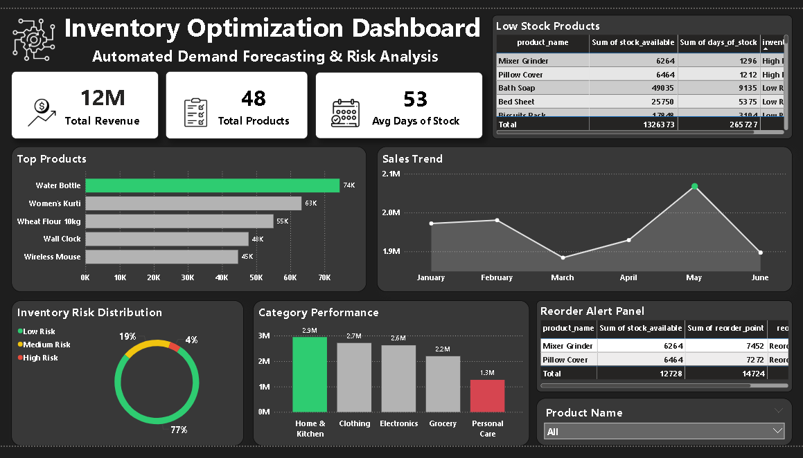

# 🚀 Automated Inventory Optimization & Demand Forecasting System

---

## 📌 Overview
This project is an end-to-end data analytics solution designed to optimize inventory management and improve demand planning. It simulates a real-world retail environment by integrating sales, product, and inventory data to generate actionable business insights.

---

## 🎯 Objective
- Detect inventory risks  
- Optimize stock levels  
- Enable data-driven decision-making  

---

## 🧱 Project Workflow

### 🔹 Step 1: Data Creation & Structuring
- Created realistic datasets for Sales, Products, and Inventory  
- Used meaningful product names, categories, and suppliers  
- Ensured proper relationships between datasets  

---

### 🔹 Step 2: Data Processing (Python)
- Cleaned and validated data using Pandas  
- Merged datasets into a single analytical dataset  
- Created key metrics:
  - Daily Average Sales  
  - Days of Stock  
  - Inventory Turnover  
- Implemented:
  - Inventory Risk Classification (High / Medium / Low)  
  - Reorder Point Logic  

---

### 🔹 Step 3: Data Analysis (SQL)
- Designed relational tables  
- Performed joins and aggregations  
- Built advanced queries for:
  - High-risk product detection  
  - Reorder recommendations  
  - Revenue contribution analysis  
  - Sales trend analysis  

---

### 🔹 Step 4: Dashboard Development (Power BI)
- Designed a professional dashboard layout  
- Created KPIs using DAX:
  - Total Revenue  
  - Total Products  
  - Avg Days of Stock  
  - High Risk Products  
- Built interactive visuals:
  - Sales trend analysis  
  - Top products performance  
  - Inventory risk distribution  
  - Low stock & reorder alerts  

---

## 📊 Key Insights
- Only ~4% of products are at high risk, indicating stable inventory health  
- Majority (~77%) of products fall under low-risk category  
- Top-performing product contributes ~74K in sales  
- Sales peaked in May, indicating seasonal demand  
- A few products require immediate reorder action  

---

## 💡 Business Impact
- Early detection of stockout risks  
- Improved inventory planning and control  
- Reduced overstock and holding costs  
- Data-driven decision-making for operations  

---

## 🛠️ Tech Stack
- Python (Pandas, NumPy)  
- SQL (Joins, Aggregations, Business Logic)  
- Power BI (Dashboard & Visualization)  

---

## 📊 Dashboard Preview

### Main Dashboard

---

## 🚀 Future Improvements
- Implement advanced forecasting models (ARIMA, Prophet)  
- Integrate real-time data pipelines  
- Build automated alert systems for low stock  

---

## 📌 Conclusion
This project demonstrates how data analytics can be used to solve real-world inventory challenges by combining automation, business logic, and interactive visualization.

---
